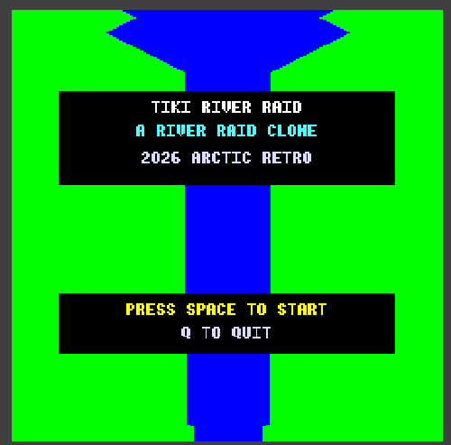
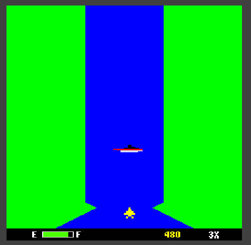

# TIKI RIVER RAID

A River Raid clone for the **TIKI-100** computer, written in C and Z80 assembly.

NOTE: The game is not bug-free, but playable. You are welcome to contribute by fixing bugs or improving the game.




---

## Quick Start

The easiest way to play is with the included emulator on Windows:

1. Launch **`tikiemul.exe`** — then load the dsk/work.dsk floppy disk image file
2. Select **R TIKIRR** from the TIKI-menu to start the game

### Running on real hardware

The `dsk/work.dsk` image is a standard TIKI-100 400K floppy format and can
be used on a real machine:

- **Gotek floppy emulator:** Copy the `.dsk` file to a USB stick and load it
  as a virtual floppy on the Gotek connected to the TIKI
- **Real 400K floppy:** Boot the TIKI-100 from the Gotek, then use the
  built-in **RÅKOPI** program to copy the disk image to a physical 5.25"
  floppy disk
- You can also use a serial connection to the TIKI and use a transfer program (Kermit) on the TIKI, but this I have not tested

---

## The TIKI-100

The **TIKI-100** (also known as the *Kontiki-100*) was a Norwegian Z80-based
microcomputer manufactured by **Tiki Data** in the mid-1980s. Designed
primarily for the Norwegian education market, it was widely deployed in
schools across Norway and became one of the most common classroom computers
of its era.

### Specifications

| | |
|---|---|
| **CPU** | Zilog Z80A @ 4 MHz |
| **RAM** | 64 KB (banked, shared with VRAM) |
| **Display** | Multiple graphics modes; Mode 3 = 256×256 pixels, 16 colours |
| **VRAM** | 32 KB, bank-switched into the lower 32K of address space |
| **Sound** | YM2149 / AY-3-8910 PSG — 3 channels |
| **Storage** | Dual 400K 5.25" floppy drives |
| **OS** | TIKO - CP/M 2.2 compatible, with custom ROM |

Despite being a CP/M machine, it had
surprisingly capable graphics and sound hardware for its time.

---

## The Game

Tiki River Raid is a vertical scrolling shooter inspired by the Activision classic. Features:

- **Procedurally generated river** — deterministic pseudo-random terrain that scrolls smoothly
- **Fuel management** — collect fuel barrels to stay airborne
- **Multiple enemy types** — helicopters, boats, and jets
- **Bridge targets** — destroy bridges to advance through sections
- **Sound effects** via the AY-3-8910 PSG
- **Lives system** — 3 lives to start

### Controls

| Key | Action |
|-----|--------|
| **A** | Move left |
| **D** | Move right |
| **Space** | Fire / Start |
| **P** | Pause / unpause |
| **Q** | Quit |

---

## Building

### Prerequisites

1. **[z88dk](https://z88dk.org/)** — the Z80 cross-compiler toolchain.
   Install to `C:\z88dk` (or adjust paths in `build.ps1`).
   The `ZCCCFG` environment variable should point to `<z88dk>\lib\config`.

2. **PowerShell** (included with Windows).

### Build

```powershell
.\build.ps1
```

This compiles all C and assembly sources and produces:

- `build/tikirr.com` — the CP/M executable
- `build/tikirr.dsk` — a raw 400K disk image

Additional build options:

```powershell
.\build.ps1 -Clean       # Clean build outputs first
.\build.ps1 -Verbose     # Show full compiler output
```

---

## Deploying

### Prerequisites

1. **Djupdal TIKI-100 emulator** — place `tikiemul.exe` in the project root (included in the repo).
   The emulator configuration file `tikiemul.ini` is included.

2. **TIKI-100 system ROM** — `tiki.rom` (included in the repo).

3. **Base disk image** — `dsk/workbase.dsk` contains the TIKI-100 OS and menu
   system. The deploy script copies this and adds the game executable.

### Deploy and run

```powershell
.\deploy.ps1
```

This will:

1. Build `tikirr.com` (if not already built)
2. Copy `dsk/workbase.dsk` to `dsk/work.dsk`
3. Write `TIKIRR.COM` into the CP/M directory on the disk image
4. Launch the Djupdal emulator with `work.dsk` on drive A:

Deploy options:

```powershell
.\deploy.ps1 -NoBuild    # Skip build, deploy existing .com file
.\deploy.ps1 -NoLaunch   # Deploy to disk image without starting emulator
```

---

## Project Structure

```
build.ps1          Build script
deploy.ps1         Deploy script (writes CP/M disk image + launches emulator)
tiki.rom           TIKI-100 system ROM
tikiemul.ini       Emulator configuration
src/
  c/               C source files (main, video, input, river, sound, sprite)
  asm/             Z80 assembly (VRAM routines, keyboard scanning)
build/             Build output (excluded from git)
dsk/               Disk images (base image + work image)
docs/              Technical notes
img/               Screenshots
```

---

## Credits

**TIKI RIVER RAID** programmed by Arctic Retro (Tommy Ovesen) with the help of Anthropic Claude Opus 4.6.

Built with [z88dk](https://z88dk.org/). Emulated with the
[Djupdal TIKI-100 emulator, Arctic retro version](https://github.com/ovesennet/Tiki-100-emulator).

